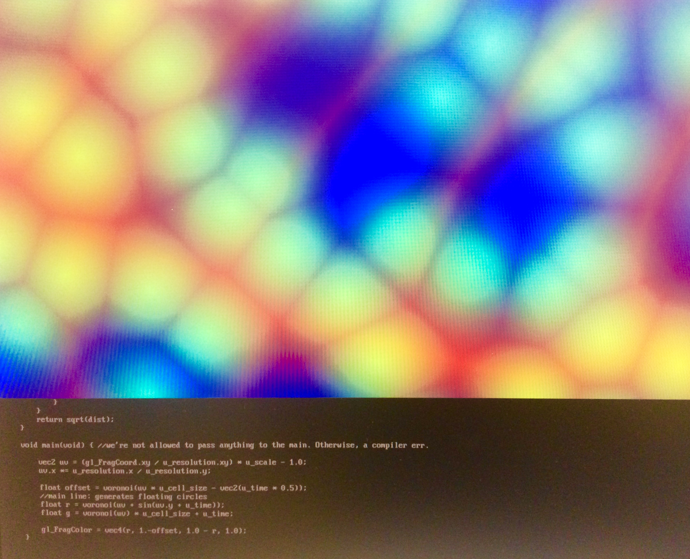

# Collaborative project SS 18/19.

[MA Creative Technologies at the Film University Babelsberg KONRAD WOLF](https://www.filmuniversitaet.de/en/studies/study-programs/master-programs/creative-technologies/)

Submitted by Valeria Barvinska (@faulty_agatha)

## Project description

The collaborative project reflects on the questions of life and non-life by transforming a space into an entity that could be claimed alive. This entity appears to have body parts (in our commonsense interpretation), such as the heart, brain, arms, eyes, and insides (bowels). 

One of my contributions is to recreate bowels as a cornerstone of the entity's energy supply, satisfaction, gut feeling, visceral fears, and ugliness. 

## Technical implementation
To visually recreate bowels, I use an ofxPiMapper addon and a custom openFrameworks project that runs a shader in real-time. 

[ofxPiMapper](https://github.com/marioguzzzman/ofxPiMapper-1/blob/master/README.md) is a projection mapping addon for openFrameworks that runs on a raspberry pi.
There are two possibilities to use this addon:

1. By using a playback video. In this case, one should setup a raspberry pi, mount usb, and copy the video(s) from usb to the ofxPiMapper.

2. By building your custom openFrameworks project that could run generative artwork in real-time. Loose instructions on how to do this could be found [here](http://projection-mapping.org/tools/ofxpimapper/).

_ofxPiMapper features **FBO sources** that allow you to create generative openFrameworks patches to be used with ofxPiMapper. **Extend the FboSource class, override setup(), update() and draw()methods and then create an instance of your custom source to add it to your ofxPiMapper object.**_

## How to run this draft

This version is setup for ofGLESWindowSettings. This allows running shaders on a raspberry pi that supports only GLES. The shader _voronoi1_ (in ofApp.cpp) is optimised for pi and will display only a grey screen if run on the laptop. Uncomment _voronoi2_ or _voronoi3_ to have the preview on your laptop. 

On pi, it currently runs as a bold square, without any possibility to modify the shape:

[Here](https://www.instagram.com/p/BzfaGkKHZ_t/) is a preview of the shader.

## To do
To set up this project for the ofxPiMapper and be able to use a mapping functionality, I need an addon [ofxPiMapper](https://github.com/marioguzzzman/ofxPiMapper-1/blob/master/README.md). According to the instruction, I can use one of the examples, such as an _example_fbo-sources_ and build my own source. I have made an attempt with another shader that uses fbo but run into problems. I can push this example if needed but I think it will cause more confusion.

Thanks a lot for your help and I'm sorry if it's not clear enough. 
